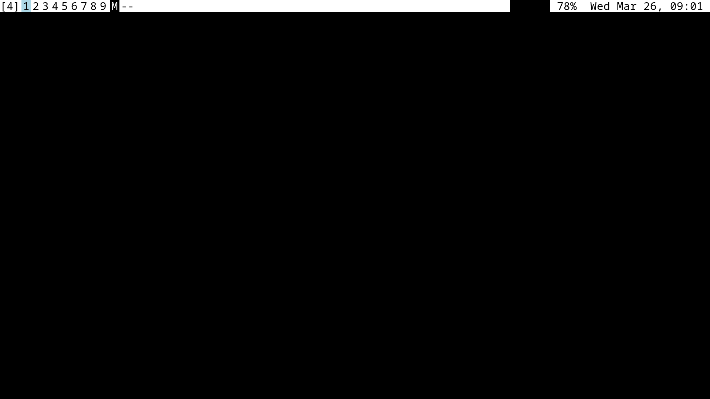
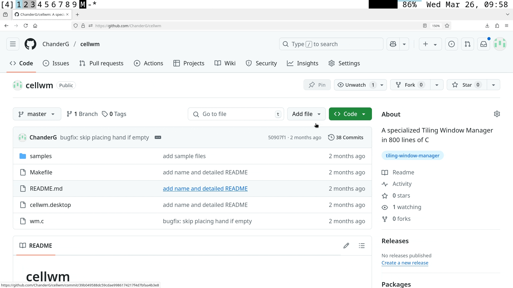
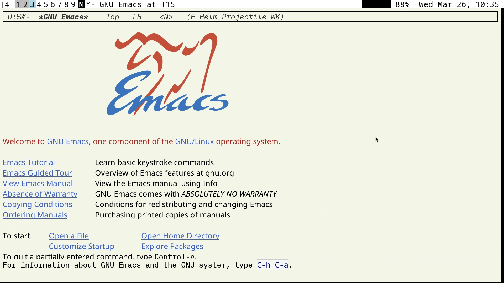
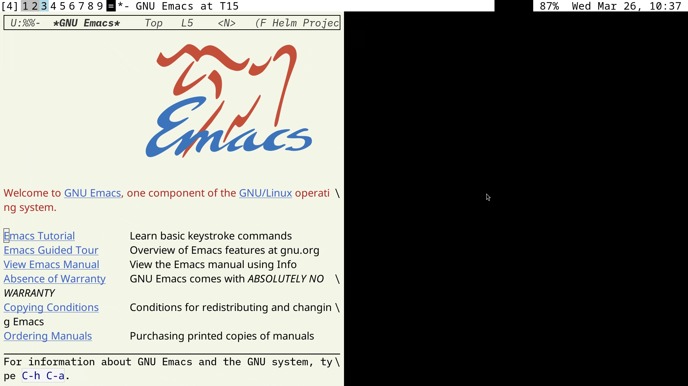
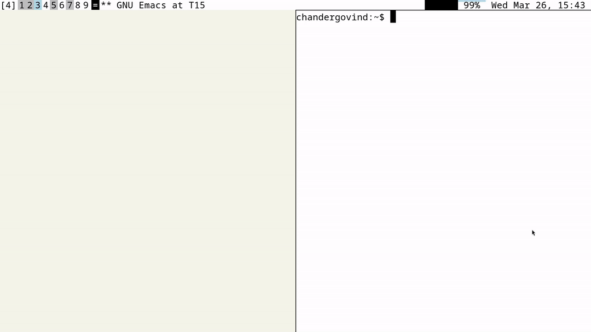

# cellwm

CellWM is a X11 Tiling Window Manager, highly specialized for my own requirements written in about 800 lines of C.

**Warning: cellwm is in early stages of its life and will continue to evolve over time. Pun intended.**



## What?

I am a big fan of [Tiling Window Managers](https://en.wikipedia.org/wiki/Tiling_window_manager) and have been using a [personalized version](https://github.com/ChanderG/my-dwm) of dwm for about 10 years as my primary driver.

In this time, I have also used the following: i3wm, exwm, awesome, hyprland, stumpwm and perhaps tried out a lot more of them. I generally prefer DWM's minimalism and consider it pretty much a perfect solution, though each WM has it's own attractive feature.

CellWM is my first attempt at writing my own WM.

## Design Considerations/Constraints

1. Minimalism. As few lines and dependencies as possible.
2. Recompile to reconfigure. Dwm style. No dynamic reloading.
   + I generally appreciate dynamism ala Lisp, but I find that after a few years, your core needs out of your WM stabilize and anything else on top is just sugar.
3. Ruthless hardcoding to my own needs. Not writing a general purpose software here.
4. Only for a single screen Laptop setting.
5. Support lot of windows/projects.
6. Hardcoded bar with only my needs: date/time, battery power, pomodoro timer.

## Design Philosophy

Driven by my needs, CellWM has three core concepts that interplay.

### Cell grid

Almost all WMs usually have named workspaces usually numbered from 1-9. Dwm has tags which is a very powerful format for multiple views of a window. 

The equivalent of Workspaces in CellWM is, you guessed it, "Cells". There are 81 cells arranged into a grid of 9x9. Yes, that is a lot of slots. But, many of them may remain empty.

Before you get concerned about navigation, at any time, a single row of cells is activated. The usual `Alt+num` format works to navigate between the cells of the current row. You can move between rows of cells, but this done one row at a time, with no direct keybindings to jump to the jth row.



### Inside a Cell

At any time, one cell of the grid is active and visible. Inside this cell, you have two slots: called primary and secondary.

Every window is assigned to a single slot in a single cell. This means that each cell can hold only two windows. This gives us a max of `2 * 9*9`, that is 162 windows. If I ever reach this limit, we will see what to do, then.



A cell can be in one of two modes: Monocle (M) or Tiling (=). In Monocle mode, the primary window is displayed taking up the entire viewport (excepting the top bar). In Tiling mode, the two windows are displayed side-by-side taking equal halves of the screen. Modes of each cell are independent.

When you open windows in an empty cell, they get assigned to the first available slot, of the two.

Apart from switching modes, the only other operation provided is "Flip" which allows you to swap the windows between the two slots of the cell.



### The Hand

What happens if you open a third window when both the slots of the current cell are occupied? The new window is not placed in, but kept in your hand, to borrow terms from card games.

This is represented by a card-like window on your screen. The hand remains in place as you navigate the cell grid. When you find your desired location, you can place the card into the cell with a keybinding, locking it into your place.



Today, there is a single slot in your hand. You can also pick up windows from anywhere into your hand if it is free. This is the only way today to move windows between cells.
 
## Installation

```
make
sudo make install
```

## About the Name

Not the brightest, I know. Like they say, one of the hardest problems in CS and all.

I would have just put my own name on it, but then I realize that I will most likely create more WMs (this time with Lisp!) in the future.

I would have liked some variant of Scroll shelf or Pigeon holes, like some of the names listed in this [Reddit thread](https://www.reddit.com/r/AskHistorians/comments/1dngya1/are_these_depictions_of_ancient_greek_and_roman/): like plutei or nidi, but those are some really obscure names.

## References

CellWM would not be possible without the following resources, in no particular order:

- https://dwm.suckless.org/
- https://github.com/mackstann/tinywm
- https://github.com/stodd1031/steveWM
- https://stackoverflow.com/questions/4037230/global-hotkey-with-x11-xlib
- https://www.cl.cam.ac.uk/~mgk25/ucs/keysymdef.h
- https://jichu4n.com/tag/window-manager/

## License 

MIT
